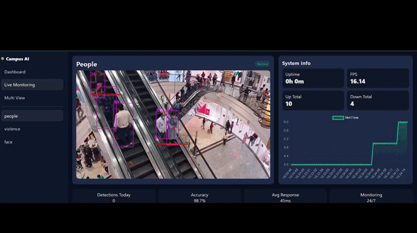

# Campus AI Dashboard

AI-powered campus monitoring dashboard with people counting, violence detection, and more.

## Features
- People counting with YOLO + SORT tracking
- Live video streams
- Real-time metrics and charts
- Multi-model support
- Web dashboard with overview, detail, and multi-view modes

## Quick Start

1. Install dependencies:
```bash
pip install -r requirements.txt
```

2. Run the dashboard:
```bash
python dashboard.py
```

3. Open in browser:
- Overview: http://localhost:8000/?view=overview
- Live Monitoring: http://localhost:8000/?view=detail&model=people
- Multi View: http://localhost:8000/?view=multiview

## Files
- `dashboard.py` - Main FastAPI server
- `dashboard.html` - Web interface
- `ppl.py` - Original people counter script
- `sort.py` - SORT tracking algorithm
- `people.mp4` - Sample video
- `mask.png` - Detection mask (optional)

## Deployment
This project can be deployed to Render, Railway, or any cloud platform that supports Python/FastAPI.
I have deployed this project on Render.
You can view it here: https://campus-ai-dashboard.onrender.com


[Watch the demo video on youtube](https://youtu.be/nnWjOoPlEwY)





